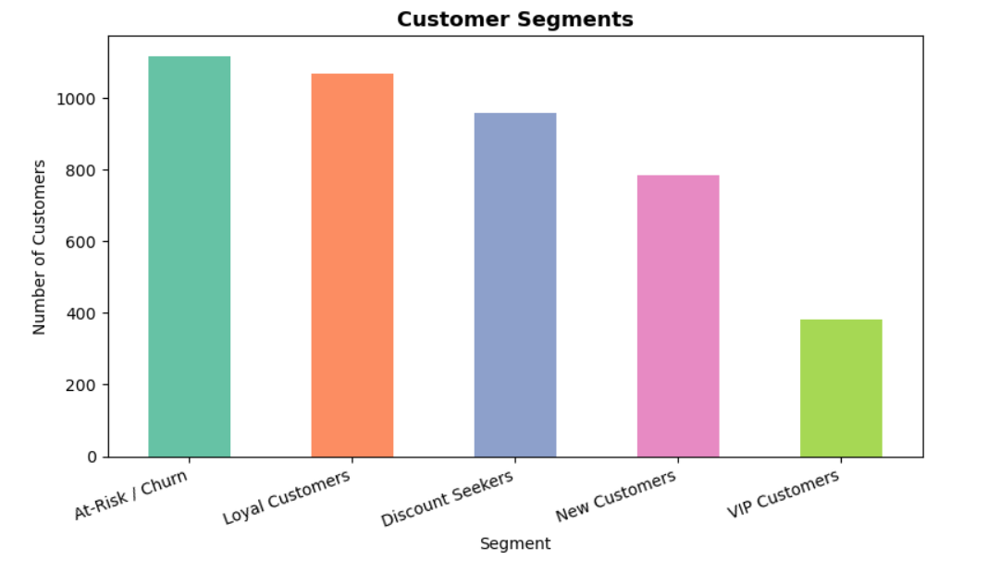

# --> Customer Segmentation using K-Means Clustering

Hey! 👋
This is a machine learning project I built during a hackathon where I explored how to segment e-commerce customers based on their purchasing behavior.

The goal was to move away from treating all customers the same and instead use data to group them into meaningful categories.

---

## --> Problem

Most online stores apply the same marketing strategy to every customer, which isn't very effective.

For example:
- High-value customers don't need discounts
- Inactive users need re-engagement
- New users need onboarding offers

So instead of guessing, I used transaction data to identify patterns and segment customers automatically.

---

## --> Approach

I used **RFM Analysis** along with **K-Means Clustering:**

- **Recency (R):** How recently a customer purchased
- **Frequency (F):** How often they purchase
- **Monetary (M):** How much they spend

Workflow:
1. Data cleaning and preprocessing
2. RFM feature engineering
3. Feature scaling
4. Finding optimal clusters (Elbow Method)
5. Applying K-Means clustering
6. Interpreting and labeling clusters

---

## --> Customer Segments

Based on the clustering results, I identified ~5 customer groups:

| Segment | Description |
|---|---|
| VIP Customers | High spend, frequent buyers |
| Loyal Customers | Consistent purchasing behavior |
| New Customers | Recently acquired |
| Discount Seekers | Likely price-sensitive buyers |
| At-Risk Customers | Low activity / churn risk |

> Note: Segment naming is based on interpretation of cluster characteristics and can be refined further.

---

## --> Project Structure

```
ecommerce-customer-segmentation/
│
├── customer_segmentation_simplified.ipynb    # main notebook
├── customer_segments.csv                     # labeled output
└── README.md
```

---

## --> Dataset

- ~500,000 transactions from an online retail dataset
- Sourced from **Kaggle** (originally from UCI Machine Learning Repository)
- Includes: Customer ID, Invoice Date, Quantity, Unit Price, etc.

---

## --> How to Run

```bash
pip install pandas numpy matplotlib seaborn scikit-learn openpyxl
```

1. Download the dataset from Kaggle
2. Save it as `online_retail_II.xlsx` in the project folder
3. Run:

```bash
jupyter notebook customer_segmentation_simplified.ipynb
```

4. Execute all cells

---

## --> Sample Output

| Customer ID | Recency | Frequency | Monetary | Segment |
|---|---|---|---|---|
| 12345 | 15 | 20 | £12,460 | VIP |
| 67890 | 214 | 1 | £280 | At-Risk |
| 11223 | 13 | 5 | £1,905 | New |

---

## --> Customer Segment Distribution



## --> Tech Stack

- Python
- pandas, numpy
- matplotlib, seaborn
- scikit-learn

---
## 👤 About

Built during a hackathon as part of exploring applied machine learning.

Still learning and experimenting — open to feedback and improvements.
